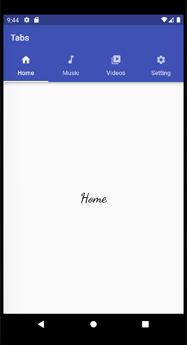
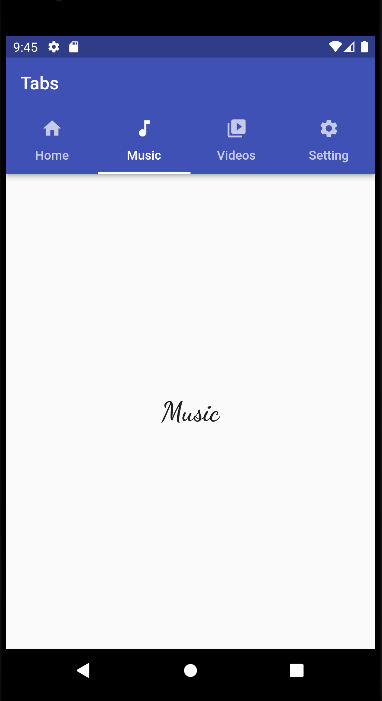
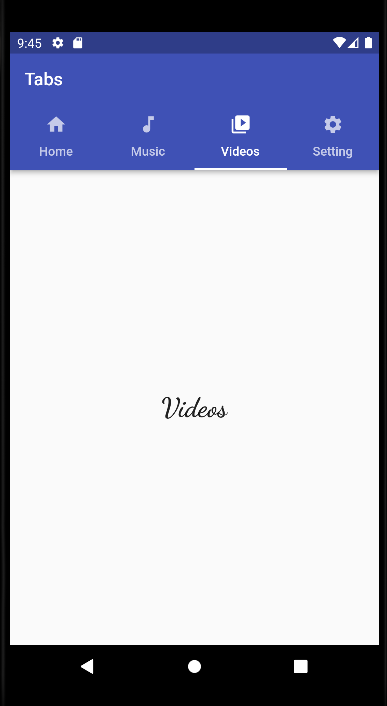
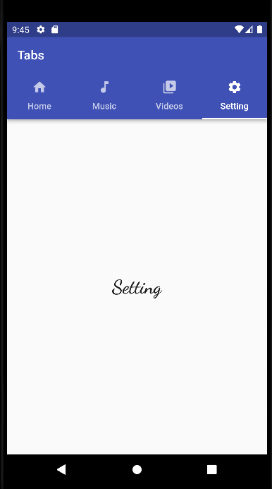

### Flutter packages:
  - carousel_slider: ^4.1.1
  - bottom_navy_bar: ^6.0.0
  - flutter_rating_bar: ^4.0.1
  - introduction_screen: ^3.0.2

| Flutter UI Design | Image |
| --- |  --- |
| Awesome Food Card |  |
| Bottom App Bar |  |
| Bottom Navigation Bar |  |
| Bottom Navigation Bar With Multiple Pages |  |
| Carousel Slider |  |
| Create Login UI |  |
| Custom Dialog Box |   |
| Custom Navigation Drawer |  |
| Dark Mode |   |
| List Cards |  |
| Modern Login UI |    |
| Onboarding Screen |     |
| Set Background Image |  |
| Splash Screen |   |
| Tabs |     |
| TODO List App |   |
